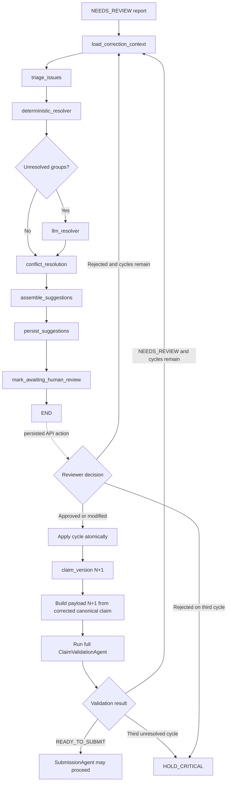

# Correction Suggester and Human Review

## Purpose

The correction workflow handles persisted validation reports whose final status
is `NEEDS_REVIEW`. It produces evidence-backed correction suggestions, stores
them for human review, and applies an approved cycle to a new immutable claim
version. It never submits a claim and never lets an LLM mutate authoritative
claim data.

The production runtime requires the configured Neo4j knowledge graph and the
MedGemma endpoint running on the DGX. In-memory repositories and fake LLM/KG
clients exist only as isolated test doubles.

## State Machine



The LangGraph run ends after durable suggestions are created. It does not keep
a process or checkpoint waiting while a person reviews the result.

## Trigger Rules

`ClaimValidationAgent` exposes the persisted `validation_report_id` and routes:

| Validation result | Next action |
| --- | --- |
| `READY_TO_SUBMIT` | `SubmissionAgent` |
| `NEEDS_REVIEW` | `CorrectionSuggesterAgent` |
| `WAITING_FOR_PAYER` | Existing asynchronous payer flow |
| `NEEDS_PRIOR_AUTH` | Existing prior-authorization flow |
| `NEEDS_PAYLOAD_REBUILD` | Existing payload-rebuild flow |
| `HOLD_CRITICAL` | Stop and escalate |

The correction graph reloads the exact persisted report and its issue rows. It
rejects a report whose claim version is no longer current.

## Resolution Policy

1. Issues are normalized and grouped by exact canonical `field_path`.
2. External decisions, routing identity, payer identity, patient identity,
   authorization references, transaction references, and critical issues are
   marked `MANUAL_RECONCILIATION_REQUIRED`.
3. Built-in versioned financial rules and approved database
   `correction_rule` records run before MedGemma.
4. Coding and documentation groups may query the existing Neo4j client for ICD
   and procedure compatibility, bundling, and required-document evidence.
5. Only unresolved groups are sent to MedGemma.
6. Conflicting candidates are merged by field. An approved deterministic rule
   outranks KG-supported evidence, which outranks an LLM proposal. A conflict
   that cannot be resolved safely becomes manual reconciliation.

Neo4j facts are evidence, not mutation instructions. A graph outage is recorded
in suggestion evidence and falls back to MedGemma or manual review. Production
container construction rejects a mock KG backend.

## MedGemma Guardrails

MedGemma receives only the affected issue, current field and value, relevant
source evidence, route, matching payer rules, and relevant KG evidence. Requests
use temperature `0` and require a strict JSON response.

A proposal is converted to manual reconciliation when it has invalid JSON or
extra/coerced fields, times out, changes a different or protected path, has
insufficient confidence, lacks evidence references, cites a payer rule that was
not supplied, proposes an unsupported value, or fails path/type validation.
Clinical facts such as diagnoses and procedures are never invented.

The MedGemma response is only a `CorrectionSuggestion`. It cannot write a claim,
payload, payer result, or route decision.

## Human Review Lifecycle

A cycle has at most three attempts and contains all suggestions for one report
and base claim version. Every suggestion must receive one persisted `APPROVED`,
`MODIFIED`, or `REJECTED` decision. Manual-reconciliation suggestions require a
validated reviewer value through `MODIFIED`.

When all suggestions are approved or modified, the apply action performs one
atomic database commit. Rejection stores history and creates another cycle when
an attempt remains. The same value and evidence fingerprint is not proposed
again. An unresolved third cycle moves the claim to `HOLD_CRITICAL`.

## Versioning and Safe Patches

Every suggestion records its base claim and payload versions plus the expected
old field value. Review and apply both verify that:

- the base claim version is still current;
- the current field value equals the stored old value;
- the path is under `canonical_claim` and is allow-listed;
- protected payer, route, identity, transaction, and authorization fields are
  not changed;
- the proposed value satisfies path-specific type and business constraints.

A mismatch marks the suggestion and cycle `STALE` and returns HTTP `409`.

Application deep-copies canonical claim version `N`, applies all reviewed
patches, and creates version `N+1`. Version `N` and payload `N` are not updated.
The builder serializes directly from the corrected canonical object through
`build_payload_from_canonical()`; it does not reconstruct the claim from stale
`source_context`. Route, eligibility reference, prior-authorization reference,
and provenance are preserved. Payload objects use a versioned, hash-bearing
object key.

## Persistence

Migration `velo_claim/migrations/007_correction_workflow.sql` creates:

- `correction_cycle`: report, base versions, attempt, state, rule snapshot;
- `correction_suggestion`: field patch proposal, evidence, provenance, stable
  idempotency hash, and status;
- `correction_review`: authenticated reviewer decision and optional value;
- `correction_rule`: explicitly approved and versioned deterministic fixes;
- `claim_version.correction_cycle_id`: provenance for corrected versions.

`claim.current_version` and `claim.current_payload_version` are advanced only
after the corrected claim version and payload are both inserted successfully.

Apply the migration on the DGX before deploying code that exposes the API:

```bash
cd /home/dev1/Desktop/data/features/feature_atta/Velo_claim
docker exec -i velo-claim-postgres-containerized \
  psql -U velo_claim -d velo_claim --single-transaction -v ON_ERROR_STOP=1 \
  < velo_claim/migrations/007_correction_workflow.sql
```

Use the actual PostgreSQL container name from `docker ps` if it differs.

## API

All endpoints use the existing bearer reviewer authentication configured by
`VELO_SUBMISSION_REVIEWERS`.

| Method | Path | Purpose |
| --- | --- | --- |
| `GET` | `/claims/{claim_id}/corrections` | List persisted cycles |
| `GET` | `/claims/{claim_id}/corrections/{cycle_id}` | Read a cycle and suggestions |
| `POST` | `/claims/{claim_id}/corrections/generate` | Generate or return the idempotent active cycle |
| `POST` | `/claims/{claim_id}/corrections/{suggestion_id}/review` | Approve, modify, or reject one suggestion |
| `POST` | `/claims/{claim_id}/corrections/{cycle_id}/apply` | Apply a fully reviewed cycle atomically and revalidate |

Example review body:

```json
{
  "decision": "MODIFIED",
  "modified_value": 125.0,
  "comment": "Confirmed against the signed encounter record."
}
```

## Environment

Production uses the shared graph configuration:

```dotenv
VELO_CLAIM_STORAGE=production
VALIDATION_KG_BACKEND=neo4j
# deploy/docker/compose.api.yaml uses network_mode: host; 7688 is the host
# port published by the current containerized Neo4j service.
NEO4J_URI=bolt://127.0.0.1:7688
NEO4J_USER=neo4j
NEO4J_PASSWORD=<secret>
NEO4J_DATABASE=neo4j
```

Correction LLM settings fall back first to validation LLM settings and then to
the common MedGemma settings:

```dotenv
USE_CORRECTION_LLM=true
CORRECTION_LLM_BASE_URL=http://<medgemma-service>:<port>
CORRECTION_LLM_API_KEY=<secret-if-required>
CORRECTION_LLM_MODEL=medgemma
CORRECTION_LLM_API_STYLE=openai_chat
CORRECTION_LLM_GENERATE_PATH=/generate
CORRECTION_LLM_TIMEOUT_SECONDS=30
CORRECTION_LLM_MIN_CONFIDENCE=0.80
```

Because the current API container uses host networking, `127.0.0.1` addresses
services published on the DGX host. Set the URL and port to the actual MedGemma
listener; do not use a guessed model-server port. If the API networking mode is
changed later, use the model container's shared-network DNS name instead.

## Failure and Retry Rules

- KG or MedGemma failure creates a manual review result instead of a fabricated
  correction.
- Suggestion generation is idempotent for the same report and base version.
- A database failure does not partially modify an authoritative claim.
- A payload rebuild failure preserves version `N` and leaves the cycle retryable.
- A revalidation exception preserves the already committed version `N+1`,
  records an audit error, and never marks the claim ready.
- Only the validation decision router may produce `READY_TO_SUBMIT`.

## Verification

```powershell
python -m pytest tests/test_correction_suggester.py -q
python -m pytest -q
```

The focused suite covers routing, triage, deterministic and LLM behavior,
conflict resolution, idempotency, reviewer actions, stale protection, immutable
versioning, payload rebuilding, revalidation, API authentication, and auditing.
